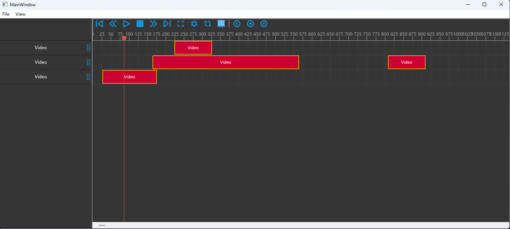
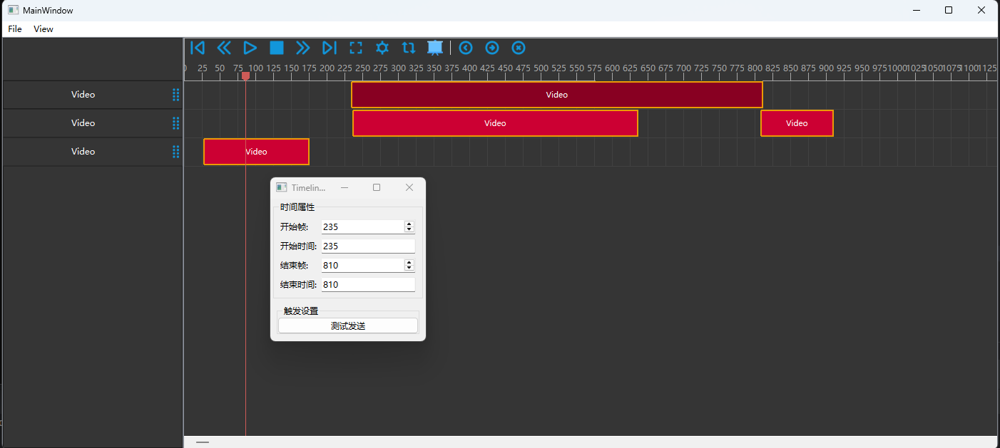

# QtTimeLine
 
## 一个基于qt的mvc结构的非线性视频编辑控件

## 已实现功能
- clip插件化，支持自定义clip,不同的clip对应不同的track,插件目录./plugins/TimeLine
- 基于AbstractClipModel可以实现片段插件的开发
- 支持clip拖动、缩放、拖拽、删除
- 支持多轨道
- 支持多轨道之间的拖拽排序
- 模型序列化和非序列化